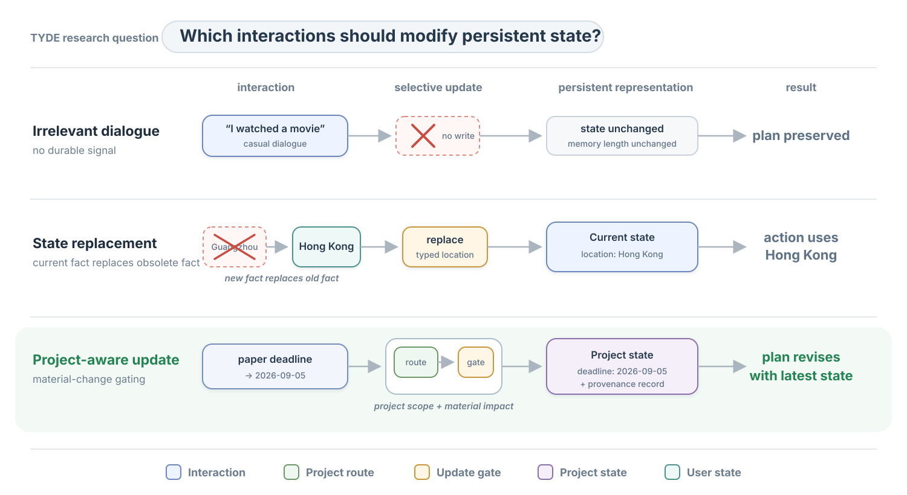

# TYDE Research Prototype

### A Stateful Agent Prototype for Long-Horizon Personal Planning

[中文说明](README.zh-CN.md)

TYDE studies a compact decision problem: after a long-running agent receives new information, should
it persist that information, where should it store it, and should it change the next action?

The prototype separates **actionable current state**, future-effective **scheduled state**,
**project-scoped memory**, and downstream planning so that each decision remains inspectable.

This directory intentionally contains no desktop UI, hosted API, account system, production database,
commercial prompt, API key, or user data. The production application remains outside this artifact.

> Status: transparent reference implementation and synthetic diagnostic set. It is not a claim of
> state-of-the-art language understanding or user benefit.



## Run in ten minutes

The reference implementation uses only the Python 3.11+ standard library. Run the following commands from the repository root:

```bash
python demo.py
python -m examples.run_cases
python -m evaluation.evaluate --fail-on-mismatch
python -m unittest discover -s tests -v
```

The main demo exposes the complete causal chain:

```text
User: I moved the paper deadline to 2026-09-05.

Detected:
  Intent: project_update
  Project: memory-research
State change:
  deadline: 2026-09-03 -> 2026-09-05

Planning impact:
  Affects plan: True
Action:
  Finish Experiment completion by 2026-09-05;
  schedule Run the baseline evaluation before it.
```

## Research motivation

Long-running agents should not treat all earlier interactions as equivalent. Some utterances define
facts that are valid **now**; some describe facts that become valid later; some contain reusable
project experience; some change a milestone or deadline; and most casual dialogue should not modify
persistent state at all.

TYDE formalizes that engineering observation as three research questions:

1. What information should become persistent state or memory?
2. How should changing state affect downstream actions?
3. How can an agent avoid false writes while preserving information that matters for future planning?

The working hypothesis is:

> Separating current, scheduled, and reusable state, then placing an explicit selective-update policy
> between routing and planning, reduces false writes and makes state-to-action consistency testable.

## Architecture

```text
New interaction
    ↓
Intent detection + project routing
    ↓
Selective update policy
    ↓
Current / scheduled / project state + project memory
    ↓
Determine whether planning is affected
    ↓
Next action
```

Five modules carry the complete mechanism:

- `router.py` classifies update type and extracts a small typed fact vocabulary.
- `state.py` owns versioned current, scheduled, and project state with atomic JSON persistence.
- `memory.py` routes project scope conservatively and stores only approved evidence.
- `planner.py` projects the latest state into an inspectable next action.
- `updater.py` decides whether an interaction is ignored, replaces state, or becomes memory.

`agent.py` wires these modules together; it does not hide a second policy.

## Memory representation

### Current state

Current state stores facts needed by the next action, not a transcript of everything that happened.

```yaml
location: Hong Kong
active_project_id: memory-research
```

If a later interaction says the user is now in Shenzhen, `location` is **replaced**. The old location
is still attributable through immutable update evidence, but it is no longer supplied to the planner
as the current truth.

### Scheduled state

Future-effective facts must not become true early:

```yaml
location: Hong Kong
valid_from: tomorrow
```

“I will be in Hong Kong tomorrow” updates scheduled state and may revise the plan, while today's
current location remains unchanged. This small representation makes the temporal boundary explicit;
it is not a general temporal reasoning system.

### Project state

```yaml
project: memory-research
deadline: 2026-09-05
current_milestone: Experiment completion
next_action: Run the baseline evaluation
```

These fields are operational. Changes to deadline, milestone, workload, blocker, or next action are
material and can revise the plan.

### Project memory

```yaml
preferences:
  - prefer morning focus blocks
decisions:
  - use public diagnostic datasets
experience:
  - reranking consistently hurt this retrieval task
```

Memory records preserve the source interaction, timestamp, project scope, kind, and extracted fields.
Candidate experience does not silently overwrite current project state.

## Selective update policy

| Interaction | Persistent target | Plan revision |
| --- | --- | --- |
| “I am tired today.” | none | no |
| “I am in Hong Kong instead of Guangzhou today.” | current state; replace `location` | yes, if an active project exists |
| “I will be in Hong Kong tomorrow.” | scheduled state; retain today's `location` | yes, if an active project exists |
| “I usually focus in the morning.” | stable preference | yes, if it changes scheduling |
| “We found reranking consistently hurts this task.” | candidate project experience | no |
| “The paper deadline moved to 2026-09-05.” | scoped project state | yes |
| ambiguous update with no reliable project | none; abstain | no |

The deterministic classifier is a **reference policy**, not the research claim. A future LLM router can
implement the same typed `Classification` contract and be compared on exactly the same write, routing,
and action-consistency metrics.

## Three explanatory cases

### 1. State replacement

`examples/case_1_state_update.json` changes today's location from Guangzhou to Hong Kong. The planner
must use Hong Kong and must not reuse Guangzhou. This tests the claim that current state controls
downstream action. Separate diagnostic cases verify that tomorrow's location is scheduled instead of
overwriting today's fact.

### 2. Ignore irrelevant dialogue

`examples/case_2_irrelevant_dialogue.json` is a movie comment unrelated to the active project. State
version and memory length must remain unchanged. This tests selective memory rather than accumulation.

### 3. Project-aware plan revision

`examples/case_3_project_revision.json` moves a paper deadline. Only that project changes, and the new
deadline must appear in the revised action. This tests project isolation and memory-to-action impact.

## Controlled diagnostic evaluation

`evaluation/dataset.jsonl` contains 35 versioned synthetic interactions, five in each category:

| Category | Question |
| --- | --- |
| State update | Was a new actionable fact stored? |
| State replacement | Did the new fact replace, rather than coexist with, the obsolete fact? |
| Hard negative | Did location idioms and malformed deadlines avoid false writes? |
| Preference | Was an explicit stable preference persisted? |
| Irrelevant chat | Did the system avoid a false write? |
| Project update | Did a material update revise the scoped project plan? |
| Cross-project noise | Did project B remain unchanged when project A was updated? |

These cases are intended as executable specifications of the proposed state/update contract, not as a benchmark for language understanding.

Reference-policy result, reproduced on 2026-09-01:

| Metric | Result |
| --- | ---: |
| Cases | 35 |
| Case pass rate | 1.000 |
| Update precision / recall | 1.000 / 1.000 |
| False-write rate | 0.000 |
| Project-routing accuracy | 1.000 |
| State-replacement accuracy | 1.000 |
| Scheduled-state accuracy | 1.000 |
| Downstream-action consistency | 1.000 |
| Cross-project isolation | 1.000 |

These results mean that the inspectable policy satisfies the hand-authored diagnostic specification.
The rules and cases were co-designed, so this table is **not** an estimate of out-of-distribution natural
language accuracy. A model comparison requires a frozen test split, repeated runs, and error analysis.

## Repository structure and reproducibility entry points

```text
./
├── .github/workflows/tests.yml
├── .gitignore
├── CITATION.cff
├── LICENSE
├── README.md
├── pyproject.toml
├── demo.py
├── tyde/
│   ├── agent.py
│   ├── memory.py
│   ├── planner.py
│   ├── router.py
│   ├── schemas.py
│   ├── state.py
│   └── updater.py
├── examples/
│   ├── case_1_state_update.json
│   ├── case_2_irrelevant_dialogue.json
│   ├── case_3_project_revision.json
│   └── run_cases.py
├── evaluation/
│   ├── dataset.jsonl
│   └── evaluate.py
├── figures/
│   └── architecture.svg
└── tests/
    └── test_research_core.py
```

## Relationship to the original TYDE implementation

This artifact extracts the research mechanism from the initial product prototype without copying its
application surface:

| Initial implementation concern | Research extraction |
| --- | --- |
| multi-stage intent router | typed transparent reference classifier |
| vector-backed project memory | conservative project-scoped router and provenance records |
| canonical consolidation | explicit replacement for a small fact vocabulary |
| project planner and calendar projection | deterministic state-to-next-action projection |
| intent-impact benchmark | 35-case diagnostic evaluation |

The larger product remains useful as an external implementation and future user-study harness. It is not
needed to inspect, run, or evaluate the mechanism in this directory.

## Claim boundary and future research

Implemented and testable here:

- typed separation of current state, scheduled state, project state, preference, and reusable experience;
- selective persistence and conservative abstention;
- project isolation;
- state replacement;
- future-effective state isolation;
- typed deadline validation;
- material-update gating;
- downstream action consistency;
- atomic local JSON persistence with provenance.

Not implemented or claimed:

- general semantic understanding;
- learned retrieval or embedding quality;
- global multi-project optimization;
- autonomous contradiction resolution for arbitrary free text;
- general named-entity recognition or temporal reasoning;
- benchmark superiority, user benefit, or production readiness.

The next credible study is to freeze this contract, replace the reference classifier with one or more
LLM policies, add a held-out paraphrase split, and compare false-write rate, routing accuracy, update
precision/recall, and action consistency under identical state fixtures.

## Research context

The prototype follows the modular-memory framing of CoALA and the memory/planning separation explored by
Generative Agents and MemGPT. Its diagnostic categories overlap with extraction, temporal reasoning,
knowledge update, and abstention abilities emphasized by LongMemEval.

- Sumers et al. [Cognitive Architectures for Language Agents](https://arxiv.org/abs/2309.02427), 2023.
- Park et al. [Generative Agents](https://arxiv.org/abs/2304.03442), 2023.
- Packer et al. [MemGPT](https://arxiv.org/abs/2310.08560), 2023.
- Wu et al. [LongMemEval](https://arxiv.org/abs/2410.10813), 2024.


